# Counting Card System for Blackjack

This project implements a **Computer Vision-based system for automatic card recognition** in blackjack games. The main goal is to assist in detecting card counting activities by analyzing video frames in real-time.

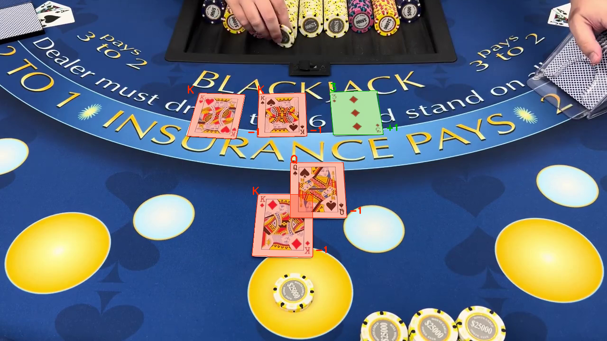

---

## Full Report

You can view the complete project report [here](https://github.com/ThePelatz/CV-HM2/blob/master/report/report.pdf).

---

## Introduction
The system captures video frames, detects individual cards, and identifies their values based on the **High-Low counting system**. Suit recognition is omitted as it is not needed for standard card counting.

---

## Implementation Notes
- Evaluations were conducted on a selected portion of the video using manually annotated ground truth via **CVAT**.
- A separate Python script handles the deep learning model for card number recognition.
- Json dependencies is automatically downloaded during `build.sh`.
- Pre-trained models are also downloaded to avoid repository bloat.

---

## Pipeline Overview
The project pipeline consists of three main stages:

1. **Preprocessing**
2. **Card Shape Recognition**
3. **Card Value Recognition**

---

## Preprocessing

### Full Image Preprocessing
Steps to detect card positions in frames:

1. **White pixel extraction:** Select bright pixels likely belonging to cards.  
2. **Morphological dilation:** Expand bright areas for consistent contours.  
3. **Contour detection and filling:** Identify connected components and fill them.  
4. **Morphological erosion:** Smooth contours and remove noise.

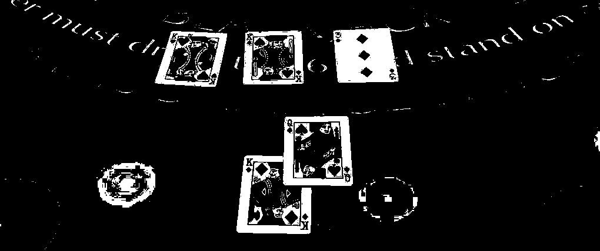
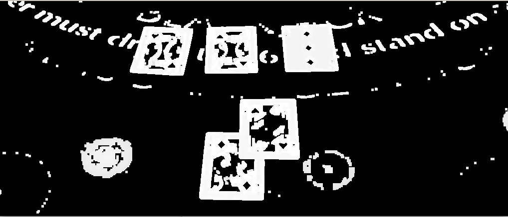
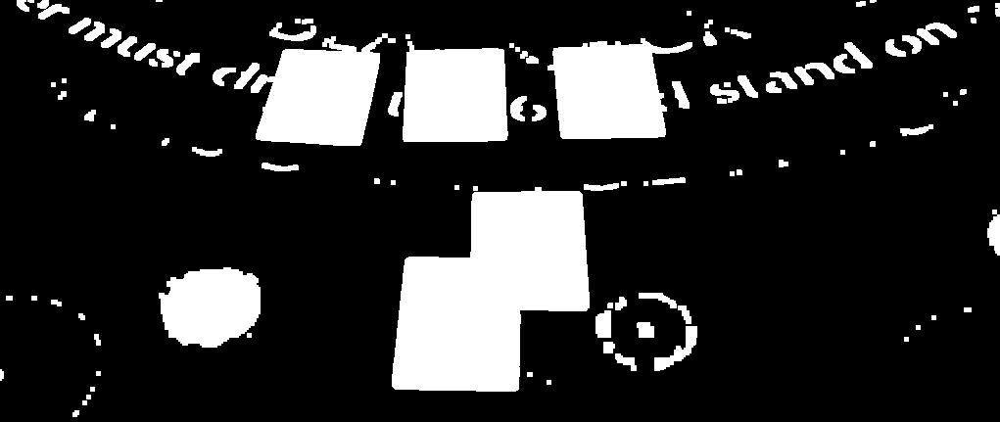
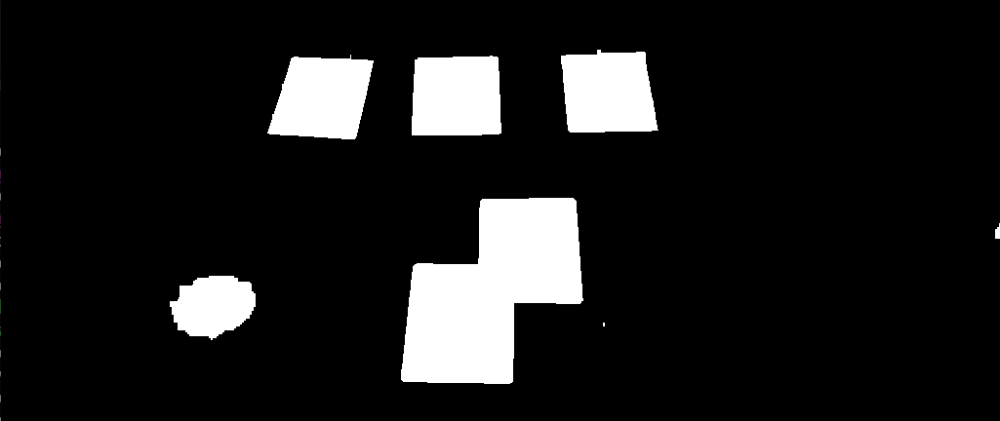

### Individual Card Preprocessing
Enhances visibility of individual cards:

1. Grayscale conversion  
2. CLAHE (Contrast Limited Adaptive Histogram Equalization)  
3. Sharpening  
4. Gaussian blur  
5. Otsu thresholding

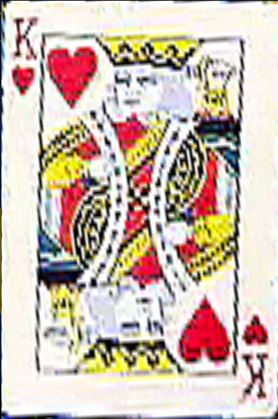 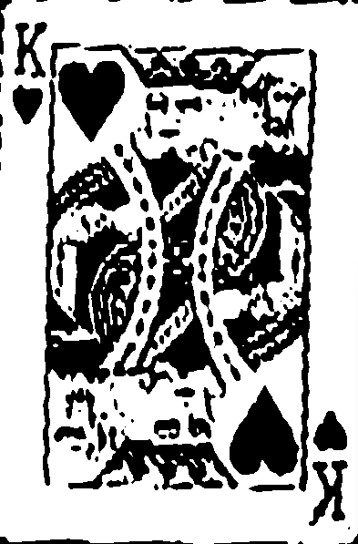

---

## Card Shape Recognition
- Inspired by Wesley Cooper's method (2004).
- Contours are extracted and filtered by area and perimeter.
- Card corners are identified using local maxima and geometric extremes.
- Output: quadrilaterals representing detected cards.

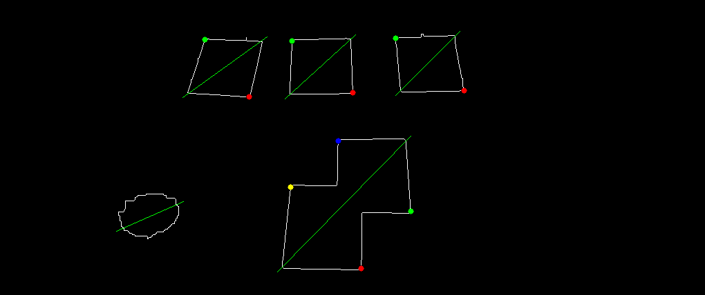
---

## Card Value Recognition

### Patch Extraction
- A fixed patch is extracted from the card's top-left corner (rank symbol).  
- Filtering is applied to select the central contours.  

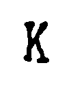 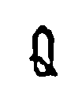 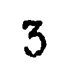

### Font and Dataset Generation


- Synthetic dataset created using:
  - "Khepri font" for **10**
  - "Card Characters Font" for other values (A, J, Q, K, 2–9)
- Each character rendered on a white canvas and augmented.

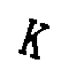 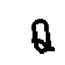 

### Convolutional Neural Network
- **Feature Extractor:** 3 Conv layers with ReLU + MaxPooling  
- **Classifier:** 2 fully connected layers, output = 13 classes  
- Trained using Adam optimizer with cross-entropy loss for 10 epochs.  

---

## Results and Performance
Evaluation metrics (frame-by-frame vs. CVAT ground truth):

| Metric   | Value |
|----------|-------|
| Precision| 0.940 |
| Recall   | 0.681 |
| F1 Score | 0.790 |

- High precision indicates reliable recognition.  
- Recall shows room for improvement in detecting all cards.

---

## Challenges and Limitations
- Table markings can be misclassified as cards  
- Low video resolution limits detail  
- Patch extraction errors reduce accuracy  
- Poker chips can cause false positives  
- Synthetic dataset imperfectly simulates real noise

---

## Future Improvements
- Enhanced preprocessing for better detection  
- Improved CNN model training  
- Add an automatic card counting module, considering game timing

---

## Build and Execution
To build the project:

```bash
sh build.sh
```

To run the project
```bash
./build/bin/cv_detection
```
